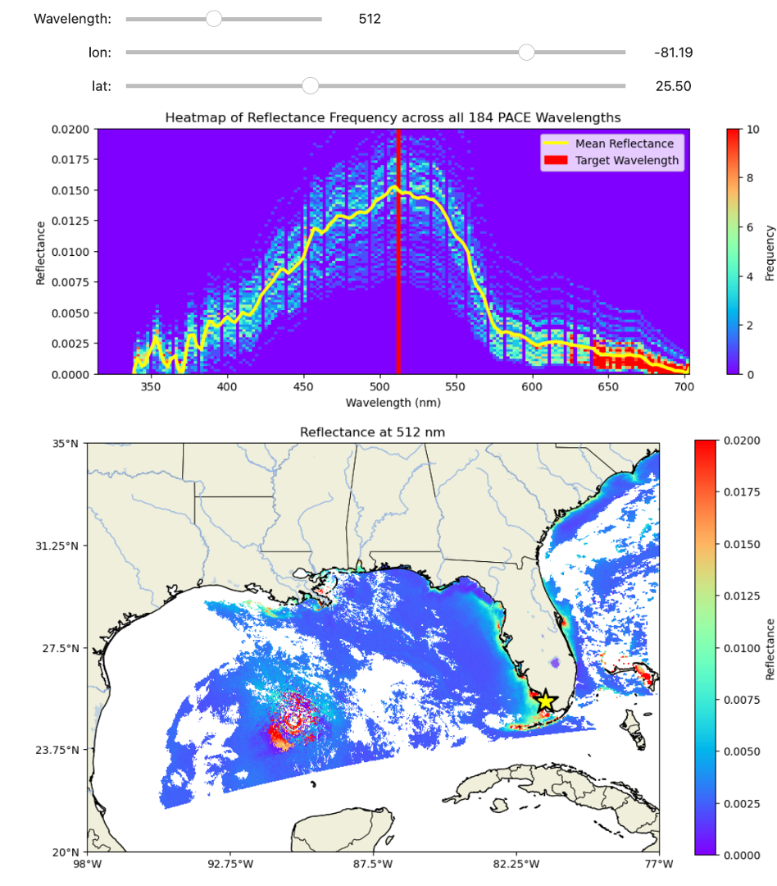
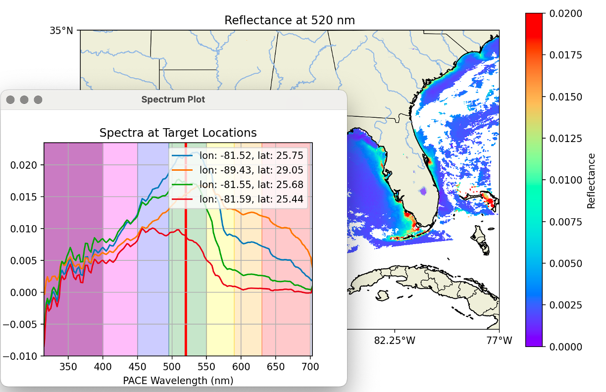

# Downloading NASA PACE Image Data Using STS Customized Hyperspectral Software

## Overview
The Science and Technology Society (STS) of Sarasota-Manatee Counties, Florida, has developed a series of Jupyter Notebooks to facilitate the downloading, processing, and visualization of PACE hyperspectral data from NASA. These tools have a long term goal of addressing the significant challenge of Red Tide (Karenia brevis) in Florida, which has severe impacts on health, marine life, and the local economy.

## Background
Red Tide is an algal bloom that releases toxic vapors, affecting respiratory health, killing marine wildlife, and damaging the tourism industry. Although Red Tide has existed for millions of years, advancements in technology, specifically through NASA's PACE (Plankton, Aerosol, Cloud, Ocean Ecosystem) satellite, offer new opportunities to identify and potentially track these Harmful Algal Blooms (HABs). This is work in progress.

### PACE Satellite
NASA's [PACE](https://pace.gsfc.nasa.gov) satellite provides hyperspectral data focusing on ocean ecosystems and phytoplankton, including Red Tide species. Each pixel in a PACE image contains 184 channels of spectral wavelength data ranging from 339nm (UV) to 719nm (near red edge of the visible spectrum). These data is stored in netCDF4 format (.nc files) and are accessible through NASA's [EarthData](https://urs.earthdata.nasa.gov/) website. You will need to create your own EarthData account to download data.

        Wavelengths: [315 316 318 320 322 325 327 329 331 334 337 339 341 344 346 348 351 353
         356 358 361 363 366 368 371 373 375 378 380 383 385 388 390 393 395 398
         400 403 405 408 410 413 415 418 420 422 425 427 430 432 435 437 440 442
         445 447 450 452 455 457 460 462 465 467 470 472 475 477 480 482 485 487
         490 492 495 497 500 502 505 507 510 512 515 517 520 522 525 527 530 532
         535 537 540 542 545 547 550 553 555 558 560 563 565 568 570 573 575 578
         580 583 586 588 591 593 596 598 601 603 605 608 610 613 615 618 620 623
         625 627 630 632 635 637 640 641 642 643 645 646 647 648 650 651 652 653
         655 656 657 658 660 661 662 663 665 666 667 668 670 671 672 673 675 676
         677 678 679 681 682 683 684 686 687 688 689 691 692 693 694 696 697 698
         699 701 702 703]

## STS Tools and Methodology
STS uses Geospatial Solution's HyperCoast software to download PACE data. We use HyperCoast because it shows the footprint of available data prior to downloading. The user can then choose the PACE data they want for their analysis from the list of available data.

```python
results, gdf = hypercoast.search_pace(
    bounding_box=(-83, 25, -81, 28),
    temporal=("2024-05-15", "2024-12-31"),
    count=-1,  # use -1 to return all datasets
    return_gdf=True,
)

hypercoast.download_pace(results[:20], out_dir="data")
```


>

The user can then visualize individual channel data in maps at a particular wavelength or analyze the entire wavelength spectrum for any pixel on the map using Python. We have also developed custom indices, such as Chlorophyll a, to enhance our analysis capabilities. Our ultimate goal is to detect and track Red Tide algal blooms using PACE data. We have a lot to learn on this subject. 

### Jupyter Notebook
We have created a Jupyter Notebook that allow users to:
1. Download PACE data using HyperCoast.
2. Process and visualize the data in Python.

This notebook provide a guide for users to access and analyze hyperspectral data, and hopefully contributing to the early detection and tracking of Harmful Algal Blooms (HABs) in the near future.

## Example Outputs
Below are examples of the outputs you can generate using our notebooks:

### Heatmap from Pixels Selected from the Map:
```python


    
    # Plot reflectance map for the larger region, showing the target location
    plt.figure(figsize=(12, 7))
    map_projection = ccrs.PlateCarree()
    ax = plt.axes(projection=map_projection)
    ax.set_extent([-98, -77, 20, 35], crs=ccrs.PlateCarree())  # Florida region
    im = ax.pcolormesh(lon, lat, reflectance_at_target, vmin=0.0, vmax=0.02, cmap='rainbow')

    ax.coastlines(resolution='10m')
    ax.add_feature(cartopy.feature.STATES, linewidth=0.5)
    ax.plot(longitude, latitude, marker='*', markersize=26, color='black')
    ax.plot(longitude, latitude, marker='*', markersize=15, color='yellow')
     
    ax.add_feature(cfeature.LAND)
    ax.add_feature(cfeature.RIVERS)
    ######ax.add_feature(cfeature.OCEAN)
    #####ax.add_feature(cfeature.COASTLINE)
    #####ax.add_feature(cfeature.BORDERS, linestyle=':')
    ax.add_feature(cfeature.LAKES, alpha=0.5)
      
    
    # Set ticks and format them
    ax.set_xticks(np.linspace(-98, -77, 5), crs=map_projection)
    ax.set_yticks(np.linspace(20, 35, 5), crs=map_projection)
    lon_formatter = LongitudeFormatter(zero_direction_label=True)
    lat_formatter = LatitudeFormatter()
    ax.xaxis.set_major_formatter(lon_formatter)
    ax.yaxis.set_major_formatter(lat_formatter)

    plt.colorbar(im, label='Reflectance')
    plt.title(f'Reflectance at {target_wavelength} nm')
    plt.show()

    
    # Plot histogram of the data
    plt.figure(figsize=(10, 1))
    plt.hist(reflectance_at_target.flatten(), bins=100, range=(0.0, 0.02), color='blue', edgecolor='black')
    plt.xlabel('Reflectance')
    plt.ylabel('Frequency')
    plt.title(f'Reflectance Histogram at {target_wavelength} nm')
    plt.grid(True)
    plt.show()
 
```

>
>*Example of a wavelength spectrum for Selected pixels.*
---

### HyperCube for Real Time selection of Pixels using Qt:

```python
class PACEVisualizer(QMainWindow):
    def __init__(self, dataset):
        super().__init__()
        self.dataset = dataset
        self.spectra_data = []  # To store spectra data for successive plots
        self.initUI()

    def initUI(self):
        self.setWindowTitle('PACE Data Visualizer')
        
        #         window.setGeometry(x, y, width, height)
        #self.setGeometry(100, 100, 1200, 900)  # Larger window size for better visibility
        self.setGeometry(10, 100, 1000, 700)  # Larger window size for better visibility
        
        self.central_widget = QWidget(self)
        self.setCentralWidget(self.central_widget)
        
        layout = QVBoxLayout(self.central_widget)
        
        self.fig = Figure(figsize=(10, 8))
        self.canvas = FigureCanvas(self.fig)
        layout.addWidget(self.canvas)
        
        self.ax = self.fig.add_subplot(111, projection=ccrs.PlateCarree())
        self.canvas.mpl_connect('button_press_event', self.onclick)
        
        self.plot_map()

        # Add buttons
        self.button_layout = QHBoxLayout()

        self.close_button = QPushButton("Close Application", self)
        self.close_button.setSizePolicy(QSizePolicy.Expanding, QSizePolicy.Preferred)
        self.close_button.setStyleSheet("font-size: 16px; font-weight: bold; padding: 10px; background-color: red; color: white;")
        self.close_button.clicked.connect(self.close_application)
        self.button_layout.addWidget(self.close_button)

        self.clear_button = QPushButton("Clear Data", self)
        self.clear_button.setSizePolicy(QSizePolicy.Expanding, QSizePolicy.Preferred)
        self.clear_button.setStyleSheet("font-size: 16px; font-weight: bold; padding: 10px; background-color: blue; color: white;")
        self.clear_button.clicked.connect(self.clear_data)
        self.button_layout.addWidget(self.clear_button)

        layout.addLayout(self.button_layout)

    def plot_map(self):
        target_wavelength = 520  # Default target wavelength
        wavelength_index = np.argmin(np.abs(wavelengths - target_wavelength))
        reflectance_at_target = reflectance_data[:, :, wavelength_index]

        self.ax.clear()
        self.ax.set_extent([-98, -77, 20, 35], crs=ccrs.PlateCarree())  # Florida region
        im = self.ax.pcolormesh(lon, lat, reflectance_at_target, vmin=0.0, vmax=0.02, cmap='rainbow')

        self.ax.coastlines(resolution='10m')
        self.ax.add_feature(cfeature.STATES, linewidth=0.5)
        self.ax.add_feature(cfeature.LAND)
        self.ax.add_feature(cfeature.RIVERS)
        self.ax.add_feature(cfeature.LAKES, alpha=0.5)

        # Set ticks and format them
        self.ax.set_xticks(np.linspace(-98, -77, 5), crs=ccrs.PlateCarree())
        self.ax.set_yticks(np.linspace(20, 35, 5), crs=ccrs.PlateCarree())
        lon_formatter = LongitudeFormatter(zero_direction_label=True)
        lat_formatter = LatitudeFormatter()
        self.ax.xaxis.set_major_formatter(lon_formatter)
        self.ax.yaxis.set_major_formatter(lat_formatter)

        plt.colorbar(im, ax=self.ax, label='Reflectance')
        self.ax.set_title(f'Reflectance at {target_wavelength} nm')
        self.canvas.draw()

    def onclick(self, event):
        if event.inaxes == self.ax:
            lon, lat = event.xdata, event.ydata
            print(f"Clicked at lon: {lon}, lat: {lat}")
            self.plot_spectrum(lon, lat)
            
    def plot_spectrum(self, lon, lat):
        try:
            # Find the closest grid point
            lat_idx, lon_idx = self.find_closest_grid_point(lat, lon)
            spectrum = reflectance_data[lat_idx, lon_idx, :]

            # Store the spectrum data
            self.spectra_data.append((lon, lat, spectrum))

            # Create a new figure for the spectrum plot if it doesn't exist
            if not hasattr(self, 'plot_window'):
                self.plot_window = QMainWindow()
                self.plot_fig = Figure(figsize=(12, 8))
                self.plot_canvas = FigureCanvas(self.plot_fig)
                self.plot_window.setCentralWidget(self.plot_canvas)
                #         window.setGeometry(x, y, width, height)
                #self.plot_window.setGeometry(200, 200, 800, 600)
                self.plot_window.setGeometry(1200, 700, 500, 400)
                self.plot_window.setWindowTitle('Spectrum Plot')
                self.plot_window.show()
                
                
                # ?????
                #self.plot_window.raise_()  # Bring the plot wind

            # Plot all stored spectra
            self.plot_fig.clear()
            ax = self.plot_fig.add_subplot(111)
            for lon, lat, spectrum in self.spectra_data:
                ax.plot(wavelengths, spectrum, label=f'lon: {lon:.2f}, lat: {lat:.2f}')
            ax.set_xlim(np.min(wavelengths), np.max(wavelengths))
            ax.set_xlabel('PACE Wavelength (nm)')
            ax.set_ylabel('Reflectance')
            ax.set_title('Spectra at Target Locations')
            
            
            ax.axvspan(300, 400, alpha=0.5, color='purple')
            ax.axvspan(400, 450, alpha=0.5, color='violet')
            ax.axvspan(450, 495, alpha=0.2, color='blue')
            ax.axvspan(495, 550, alpha=0.2, color='green')
            ax.axvspan(550, 590, alpha=0.2, color='yellow')
            ax.axvspan(590, 630, alpha=0.2, color='orange')
            ax.axvspan(630, 700, alpha=0.2, color='red')
            ax.axvspan(700, 1000, alpha=1,  color='lavender')
            
            target_wavelength = 520
            ax.axvspan(target_wavelength-1, target_wavelength+1, alpha=1, color='red')

            ax.grid()
            ax.legend(loc='upper right')
            self.plot_canvas.draw()

        except IndexError as e:
            print(f"Error: {e}")
            print("Clicked point is out of bounds due to indexing error.")
    
    def find_closest_grid_point(self, latitude, longitude):
        distances = np.sqrt((lat - latitude)**2 + (lon - longitude)**2)
        min_distance_idx = np.unravel_index(np.argmin(distances), distances.shape)
        return min_distance_idx

    def clear_data(self):
        self.spectra_data = []
        if hasattr(self, 'plot_fig'):
            self.plot_fig.clear()
            self.plot_canvas.draw()
        print("Cleared selected spectra data.")

    def close_application(self):
        # Ensure the plot window is closed properly
        if hasattr(self, 'plot_window') and self.plot_window is not None:
            self.plot_window.close()
        self.close()  # Close the main window

def main():
    app = QApplication(sys.argv)
    ex = PACEVisualizer(dataset)
    ex.show()     
    sys.exit(app.exec_())  # Use sys.exit to properly exit the application
    #plt.close(plt.gcf())
    #plt.close('all')
    #plt.close(1)
    
    
if __name__ == '__main__':
    main()

```

>
>*Example of HyperCube selection of Pixels for May 21, 2024.*
---
### Process PACE data for Chlorophyll a:

#### This is our attempt to calculate Chlorophyll_a using PACE data following the methods described in the source below:
```python

'''
We used the following source:

        Earth Data Tools Method Datad 2023 used for PACE Data

        Viewing Chlorophyll a — Algorithm Publication Tool.pdf

        Jeremy Werdell and John O'Reilly and Chuanmin Hu and Lian Feng and 
        Zhongping Lee and Bryan Franz and Sean Bailey and Christopher Proctor, 
        Chlorophyll a, Earth Data Publications Tool, November 6, 2023
'''


# Identify indices for the required bands
band_442 = np.argmin(np.abs(wavelengths - 442))
band_490 = np.argmin(np.abs(wavelengths - 490))
band_510 = np.argmin(np.abs(wavelengths - 510))
band_555 = np.argmin(np.abs(wavelengths - 555))
band_670 = np.argmin(np.abs(wavelengths - 670))

# Extract reflectance values at the required wavelengths
Rrs_442 = reflectance_data[:, :, band_442]
Rrs_490 = reflectance_data[:, :, band_490]
Rrs_510 = reflectance_data[:, :, band_510]
Rrs_555 = reflectance_data[:, :, band_555]
Rrs_670 = reflectance_data[:, :, band_670]

'''
1. chlor_a is first calculated using the CI algorithm, which is a three-band reflectance difference algorithm employing the difference between sensor specific Rrs in the green band and a reference formed linearly between Rrs in the blue and red bands (bands are instrument specific - see Table 1):
CI = Rrs(λgreen) − [Rrs(λblue) + (λgreen − λblue)/(λred − λblue) ∗ (Rrs(λred) − Rrs(λblue))] 
'''

# Calculate CI
CI = Rrs_555 - (Rrs_442 + (555 - 442) / (670 - 442) * (Rrs_670 - Rrs_442))

# A calculation of CI chlor_a is done using two coefficients (a0CI = -0.4287 and a1CI = 230.47) specified by Hu et al (2019), where:
# chlor_a = 10**(-0.4287 + 230.47 * CI)
# is this used for anything?

'''
2. chlor_a is then calculated following the OCx algorithm, which is a fourth-order polynomial relationship between a ratio of Rrs and chlor_a: 
'''
    
# Calculate chlor_a using CI
chlor_aCI = 10**(0.32814 + -3.20725*np.log10(Rrs_442 / Rrs_555)**1 + 
                            3.22969*np.log10(Rrs_442 / Rrs_555)**2 + 
                           -1.36769*np.log10(Rrs_442 / Rrs_555)**3 + 
                           -0.81739*np.log10(Rrs_442 / Rrs_555)**4)


'''
OCx Method (I think?)
'''

# Define OCx algorithm coefficients for OC4v6 as an example
a0, a1, a2, a3, a4 = -0.3704, -3.9622, 1.7441, 1.4487, -0.2874

# Calculate the OCx ratio
R = np.maximum.reduce([Rrs_442 / Rrs_555, Rrs_490 / Rrs_555, Rrs_510 / Rrs_555])


# Calculate chlor_a using OCx
log_chlor_a_OCx = a0 + a1 * np.log10(R) + a2 * np.log10(R)**2 + a3 * np.log10(R)**3 + a4 * np.log10(R)**4
chlor_a_OCx = 10**log_chlor_a_OCx

'''
3. For chlor_a retrievals below 0.25 mg m-3, the CI algorithm is used.

For chlor_a retrievals above 0.35 mg m-3, the OCx algorithm is used. 

In between these values, the CI and OCx algorithm are blended using a weighted approach:
'''

# Initialize the chlorophyll-a concentration array
chl_a_CI = np.zeros_like(CI)

# Define thresholds
t1 = 0.25
t2 = 0.35

# Apply the OCI algorithm to estimate chlorophyll concentration
positive_CI_mask = chlor_aCI > t2
negative_CI_mask = chlor_aCI < t1
blended_CI_mask = (~positive_CI_mask) & (~negative_CI_mask)

# Calculate chlorophyll-a for positive CI values
chl_a_CI[positive_CI_mask] = chlor_aCI[positive_CI_mask]

# Calculate chlorophyll-a for negative CI values
chl_a_CI[negative_CI_mask] = chlor_a_OCx[negative_CI_mask]

# Blend CI and OCx for values in between
chl_a_CI[blended_CI_mask] = ((chlor_aCI[blended_CI_mask] * (t2 - chlor_aCI[blended_CI_mask])) / (t2 - t1) +
                             (chlor_a_OCx[blended_CI_mask] * (chlor_aCI[blended_CI_mask] - t1)) / (t2 - t1))

```
>
>*Example of a Chlorophyll a concentration map May 21, 2024.*
---
>
>*Example of a Chlorophyll a concentration map May 21, 2024.*
---
>
>*WorldView Chlorophyll a map May 21, 2024.*
---

### Since our PACE Webinar on June 7, we are also using [WorldView](https://worldview.earthdata.nasa.gov/?v=-99.09292764857383,18.857870096514613,-73.64517039265459,32.90845125461138&l=Reference_Labels_15m(hidden),Reference_Features_15m(hidden),Coastlines_15m,OCI_PACE_Chlorophyll_a,VIIRS_NOAA20_CorrectedReflectance_TrueColor(hidden),VIIRS_SNPP_CorrectedReflectance_TrueColor(hidden),MODIS_Aqua_CorrectedReflectance_TrueColor(hidden),MODIS_Terra_CorrectedReflectance_TrueColor&lg=true&t=2024-06-07-T14%3A54%3A38Z) to compare our calculated Chlorophyll_a to their products and tweak our code and displays as needed. WorldView is an impressive product from NASA. 
---


## Additional Resources
The repository also includes the original PACE Access Data notebook, as proposed by the Ocean Color Instrument (OCI), for users who wish to explore further:

    Authors: Anna Windle (NASA, SSAI), Ian Carroll (NASA, UMBC), Carina Poulin (NASA, SSAI)

This is the original Jupyter Notebook used to download PACE data supplied by NASA. 
---

By using these tools, STS and citizen scientists aim to be part of the solution in detecting, tracking and hopefully mitigating the impacts of Red Tide through advanced hyperspectral data analysis.


> **PREREQUISITES**
>
> This notebook has the following prerequisites:
> - An **<a href="https://urs.earthdata.nasa.gov/" target="_blank">Earthdata Login</a>**
>   account is required to access data from the NASA Earthdata system, including NASA ocean color data.
> - There are no prerequisite notebooks for this module.
